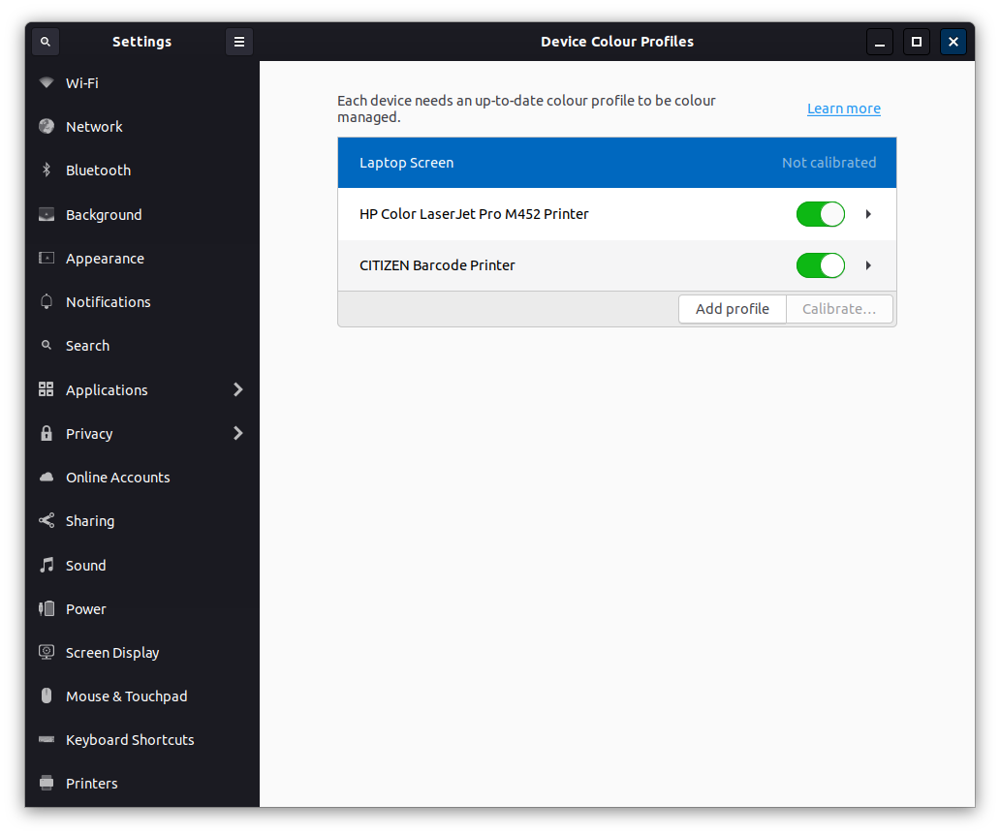

# Star Labs ICC Colour Profiles 

An ICC profile will tune your display to output colours as accurately as possible.

On Debian based distributions (which includes Ubuntu, Linux Mint, elementary OS and Zorin OS), you can install the ICC Color Profiles by entering the below commands into a terminal window:

```
sudo add-apt-repository ppa:starlabs/ppa
sudo apt install starlabs-icc
```

On Manjaro, you can use the below command:

```
sudo pacman -Syu starlabs-icc
```

Or, if you would prefer to use pamac: 

```
pamac install starlabs-icc
```

For other distributions, you can download the Colour Profiles using the links below:

[Star Lite Mk II](ICC/StarLiteMkII.icc)

[Star Lite Mk III](ICC/StarLiteMkIII.icc)

[Star LabTop Mk III](ICC/StarLabTopMkIII.icc)

[Star LabTop Mk IV](ICC/StarLabTopMkIV.icc)


Once the profiles are installed, you need to select them under Device Colour Profiles which is found under Settings.



Click Add Profile and then select the correct profile for your laptop, such as StarLiteMkII.


## Copying or Reusing

This project has mixed licencing. You are free to copy, redistribute and/or modify aspects of this work under the terms of each licence accordingly (unless otherwise specified).

The StarLabs icon assets (any and all source `.svg` files or rendered `.png` files) are licensed under the terms of the [Creative Commons Attribution-ShareAlike 4.0 License](https://creativecommons.org/licenses/by-sa/4.0/).

Included scripts are free software licensed under the terms of the [GNU General Public License, version 3](https://www.gnu.org/licenses/gpl-3.0.txt).

Thanks to [Materia](https://github.com/nana-4/materia-theme) and all others that this theme was forked and inspired from.

# [© Star Labs® / All Rights Reserved.](https://starlabs.systems)
Any issues or questions, please contact us at [support@starlabs.systems](mailto:supportstarlabs.systems)

View our full range of Linux laptops at: [https://starlabs.systems](https://starlabs.systems)

